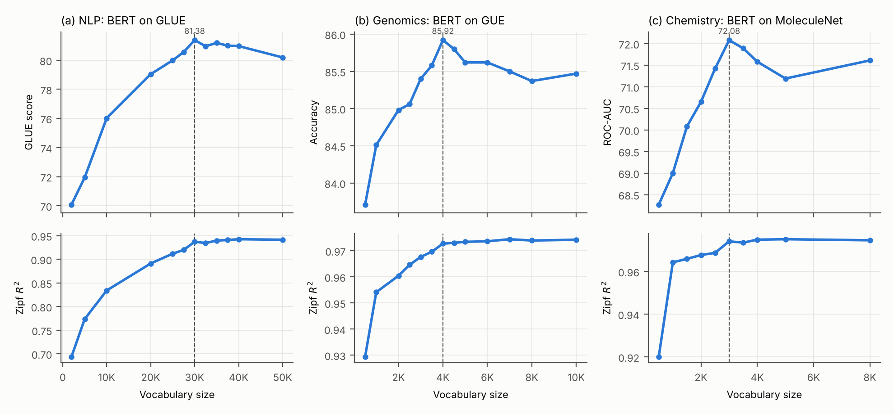
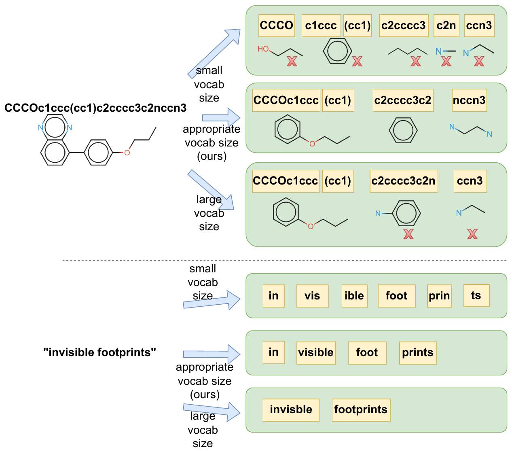

# Pre-trained Models Perform the Best When Token Distributions Follow Zipf's Law

Code for the EMNLP 2025 (main) paper

> **Pre-trained Models Perform the Best When Token Distributions Follow Zipf's Law**
> Yanjin He, Qingkai Zeng, Meng Jiang
> [[ACL Anthology]](https://aclanthology.org/2025.emnlp-main.1421/) [[arXiv]](https://arxiv.org/abs/2507.22543)

The vocabulary size of a tokenizer is usually fixed by heuristics (e.g. "50K").
We select it from the data instead: train BPE, look at the token
**rank-frequency distribution on a log-log scale**, and measure how close it is
to a straight line (a power law, i.e. Zipf's law) with the coefficient of
determination R² of a least-squares fit. Across NLP (BERT on GLUE, mBART on
IWSLT), genomics (DNA BERT on GUE) and chemistry (SMILES BERT on MoleculeNet),
downstream performance peaks where the token distribution reaches its best
Zipfian alignment.



> **Note.** The original experiment scripts were lost and this codebase was
> re-implemented from the paper. Settings that the paper does not state
> (optimisation hyper-parameters, ε and N of the selection rule, …) are set to
> standard values listed [below](#hyper-parameters), so numbers obtained with
> this code may differ slightly from the tables.

## Contents

```
zipftok/                     core library
  zipf.py                    rank-frequency curve, log-log least-squares fit, R^2 (+ segmented fit)
  selection.py               Zipf-guided vocabulary size selection (stagnation counter, epsilon, N)
  bpe_json.py                exact truncation of a trained BPE model to any smaller size
  tokenization.py            BPE training presets (text / translation / dna / smiles), export to transformers
  counting.py                token frequency counting (full encoding or one pass per distinct word)
  noising.py, collators.py   mBART denoising (sentence permutation + Poisson span infilling)
  metrics.py                 GLUE / GUE / MoleculeNet / BLEU metrics as reported in the paper
  data.py                    corpus readers (Hugging Face datasets, text, jsonl, csv, smi, FASTA)
scripts/
  train_tokenizer.py         BPE tokenizers for a grid of vocabulary sizes
  zipf_analysis.py           R^2 per tokenizer + log-log rank-frequency plot (Figure 1)
  select_vocab_size.py       the vocabulary selection algorithm of Section 3.3
  pretrain_mlm.py            BERT MLM pre-training (NLP, DNA, SMILES)
  pretrain_mbart.py          mBART multilingual denoising pre-training (WMT)
  finetune_glue.py           GLUE fine-tuning (Table 1)
  finetune_translation.py    IWSLT fine-tuning + BLEU (Table 4)
  finetune_gue.py            GUE fine-tuning (Table 2)
  finetune_moleculenet.py    MoleculeNet fine-tuning, scaffold split, ROC-AUC (Table 3)
  aggregate_results.py       seeds -> tables like Tables 1-4 (+ correlation with R^2)
  plot_performance.py        performance and R^2 vs. vocabulary size (Figure 2)
  case_study.py              segmentation of an input at several vocabulary sizes (Figure 3)
  prepare_data/              DNA corpus from FASTA, ZINC20 subset, MoleculeNet download
run/                         end-to-end pipelines for the four settings
configs/                     model architectures and the vocabulary grids of the paper
results/paper/               Tables 1-4 of the paper as CSV
tests/                       unit tests (python -m unittest discover -s tests)
```

## Installation

```bash
git clone https://github.com/yanjinhe/Tokenizer.git && cd Tokenizer
pip install -r requirements.txt          # or: pip install -e ".[all]"
pip install rdkit                         # only for the MoleculeNet scaffold split
python -m unittest discover -s tests      # quick self-check
```

The experiments in the paper used HuggingFace Transformers v4.38 and PyTorch 2.0.
The scripts also handle the argument renames of later 4.x releases
(`eval_strategy`, `processing_class`).

## The method in a few lines

```python
from zipftok import zipf_score, zipf_guided_selection, vocab_schedule
from zipftok.tokenization import train_bpe, truncate_tokenizer
from zipftok.counting import WordTable, count_tokens

texts = [...]                                         # your corpus
bpe = train_bpe(texts, 60000, preset="text")          # BPE trained once, up to the largest size
words = WordTable.from_texts(bpe, texts)              # pre-tokenized words, counted once

def zipf_t(v):                                        # Zipf_t: R^2 of the log-log fit at size v
    tok = truncate_tokenizer(bpe, v)                  # == BPE trained with vocab_size=v
    return zipf_score(count_tokens(tok, table=words)).r2

result = zipf_guided_selection(zipf_t, vocab_schedule(2000, 60000, step=2500), epsilon=1e-3, patience=2)
print(result.optimal_vocab_size)                      # V_opt
```

**Zipf alignment score.** Token counts are sorted in decreasing order, giving
the rank-frequency curve `(r, f(r))`; tokens that never occur are dropped and
special tokens are excluded. A line is fitted to `(log10 r, log10 f(r))` by
ordinary least squares with one point per rank, and its R² is the score
(`zipftok.zipf.fit_loglog`). Options for robustness checks: a fixed slope of −1
(`reference="zipf"`), log-binned points (`weighting="log_binned"`) and a
two-regime segmented fit (Cancho & Solé, 2001), all reported by
`zipf_analysis.py`.

**Selection algorithm (Section 3.3).** Start from a small vocabulary and grow it
step by step with BPE. After the t-th update re-tokenize the corpus and compute
`Zipf_t`; keep the best score `Zipf_max`. If `Zipf_t` does not exceed `Zipf_max`
by more than `ε` for `N` consecutive steps, stop. By default `V_opt` is the
vocabulary of the last meaningful improvement (the one that set `Zipf_max`);
`--return_vocab stop` returns the vocabulary at which the expansion stopped.

**Growing BPE without re-training.** BPE is greedy, and the HuggingFace trainer
assigns ids in creation order and stops as soon as the vocabulary is full, so
the tokenizer of size `V` is exactly the first `V` ids and the merges up to the
one that created id `V − 1` of a tokenizer trained to any larger size
(`zipftok/bpe_json.py`; `tests/test_bpe_json.py` checks this against a
reference re-implementation of the trainer, and `tests/test_hf_integration.py`
against the installed `tokenizers` library). Use `--independent` / `--retrain`
to train every size from scratch instead.

## Quick start

```bash
# R^2 for a grid of vocabulary sizes on BookCorpus (Hypothesis 1, Figure 1)
python scripts/train_tokenizer.py --preset text --corpus hf:bookcorpus::train:text \
    --max_texts_per_corpus 1000000 --vocab_sizes 2k,5k,10k,20k,30k,40k,50k --output_dir outputs/demo/tokenizers
python scripts/zipf_analysis.py --tokenizers outputs/demo/tokenizers/vocab_* \
    --corpus hf:bookcorpus::train:text --max_texts 200000 --output_dir outputs/demo/zipf

# select the vocabulary size directly (Section 3.3)
python scripts/select_vocab_size.py --preset smiles --corpus data/zinc20/train.txt \
    --initial_vocab 500 --step 500 --max_vocab 10000 --epsilon 1e-3 --patience 2 \
    --output_dir outputs/smiles/selection
```

Corpora are given as local files (`.txt`, `.jsonl`, `.csv`, `.smi`, FASTA,
optionally `.gz`) or Hugging Face datasets written as
`hf:NAME:CONFIG:SPLIT:COLUMN` (e.g. `hf:wmt16:de-en:train:translation.de`).

## Reproducing the experiments

Each pipeline trains the tokenizers of the paper's grid, runs the Zipf
analysis, pre-trains one model per vocabulary size, fine-tunes three seeds per
task and aggregates the table. Stages can be selected with `STAGES`, the grid
with `VOCABS`, GPUs with `NGPU`:

```bash
NGPU=8 bash run/run_text_bert.sh                    # Table 1: BERT, OpenWebText + BookCorpus -> GLUE
PAIR=de-en bash run/run_translation_mbart.sh        # Table 4: mBART, WMT16 -> IWSLT14 (also fr-en, zh-en)
bash run/run_dna_bert.sh                            # Table 2: DNA BERT -> GUE
bash run/run_smiles_bert.sh                         # Table 3: SMILES BERT, ZINC20 -> MoleculeNet
STAGES="aggregate" bash run/run_text_bert.sh        # rebuild a table from finished runs
```

| Setting | Pre-training data | Model | Downstream | Metric | Vocabulary sizes |
|---|---|---|---|---|---|
| NLP | OpenWebText + BookCorpus (MLM) | BERT, 12 layers, 768 hidden | GLUE w/o WNLI | MCC / Acc / (Acc+F1)/2 / (Pearson+Spearman)/2 | 2K – 50K |
| Translation | WMT De-En, Fr-En, Zh-En (multilingual denoising) | mBART, 6+6 layers, d=1024 | IWSLT14 De-En, IWSLT17 Fr-En, IWSLT15 Zh-En | BLEU | 2K – 140K |
| Genomics | DNABERT-2 pre-training genomes (MLM) | BERT | GUE (8 tasks) | Accuracy | 0.5K – 10K |
| Chemistry | first 5M SMILES of ZINC20 (MLM) | BERT | MoleculeNet BBBP, Tox21, SIDER, ClinTox, HIV, BACE | ROC-AUC | 0.5K – 8K |

Pre-training uses `torchrun` over `NGPU` GPUs; fine-tuning runs on one GPU
(`FT_GPU`). Fine-tuning inputs are truncated to the pre-training sequence
length, since BERT's learned position embeddings beyond it are untrained.

The models grow with the vocabulary: BERT has about 88M parameters at 2K and
125M at 50K tokens, mBART about 180M at 2K and 322M at 140K tokens (cf.
Appendix D).

**Data preparation.**

* *NLP / translation*: downloaded from the Hugging Face hub (`bookcorpus`,
  `Skylion007/openwebtext`, `nyu-mll/glue`, `wmt16`/`wmt14`/`wmt18`,
  `IWSLT/iwslt2017`). Script-based datasets need `datasets<4`. IWSLT14 De-En and
  IWSLT15 Zh-En are read from plain parallel text files
  `{train,valid,test}.{src,tgt}` (set `IWSLT_DIR`), e.g. produced with fairseq's
  `examples/translation/prepare-iwslt14.sh` before its BPE step.
* *Genomics*: build the pre-training corpus from the FASTA files used by
  DNABERT-2 with `scripts/prepare_data/prepare_dna_corpus.py`; download the GUE
  benchmark as described in the [DNABERT-2 repository](https://github.com/MAGICS-LAB/DNABERT_2)
  and extract it to `data/GUE`. The GUE tasks of Table 2 map to
  `prom/prom_core_all` (CPD), `tf/0`, `tf/1` (H-TFP1/2), `prom/prom_300_all` (PD),
  `mouse/0`, `mouse/1` (M-TFP1/2), `EMP/H3`, `EMP/H4`.
* *Chemistry*: `scripts/prepare_data/prepare_zinc20.py` extracts the first 5M
  SMILES from ZINC20 tranche files; `scripts/prepare_data/download_moleculenet.py`
  fetches the six MoleculeNet CSVs.

### Hyper-parameters

Settings stated in the paper: BPE tokenizers, vocabulary grids (Section 4.4),
MLM / multilingual denoising objectives, BERT and mBART families with the
parameter counts of Appendix D, the downstream datasets and metrics, three
seeds per configuration, R² of a least-squares fit for the Zipf score. The
remaining defaults (all are command-line flags):

| | Pre-training | Fine-tuning |
|---|---|---|
| BERT (NLP) | seq. 128, 100K steps, lr 5e-4, batch 32/GPU, warmup 6%, MLM 15% | GLUE: lr 2e-5, batch 32, 3 epochs (5 for MRPC, STS-B, RTE), dev-set scores |
| BERT (DNA) | seq. 256, 100K steps, lr 5e-4 | GUE: lr 3e-5, batch 32, 3–5 epochs (as DNABERT-2), best dev checkpoint, test accuracy |
| BERT (SMILES) | one molecule per example (≤ 128 tokens), 100K steps, lr 5e-4 | MoleculeNet: scaffold split 80/10/10 (DeepChem rule), lr 3e-5, 10 epochs, best valid ROC-AUC, test ROC-AUC |
| mBART | docs ≤ 512 tokens, 35% words masked with Poisson(3.5) spans, sentence permutation, 100K steps, lr 3e-4 | IWSLT: lr 3e-5, 10 epochs, label smoothing 0.1, dropout 0.3, beam 5, corpus BLEU with nltk as in the paper (`--bleu_backend sacrebleu` available) |
| Selection rule | ε = 1e-3, N = 2 | |

## Results reported in the paper

Tables 1–4 are in [`results/paper/`](results/paper). Best average scores and
the corresponding R²:

| Setting | Best vocabulary | Avg. score | R² at best | R² plateau reached at |
|---|---|---|---|---|
| NLP (GLUE) | 30K | 81.38 | 0.9372 | ≈30K |
| Genomics (GUE) | 4K | 85.92 | 0.9727 | ≈4K |
| Chemistry (MoleculeNet) | 3K | 72.08 | 0.9741 | ≈3K |

`python scripts/plot_performance.py --paper --out figure2.png` redraws Figure 2
from these tables (the translation panels go to `figure2_translation.png`).

### Case study (Figure 3)

<p align="center">
  
</p>

With an appropriate vocabulary size the tokenization is not only more
effective but also captures the essential patterns of the sequences. A
vocabulary that is too small fragments the molecule
`CCCOc1ccc(cc1)c2cccc3c2nccn3` into pieces that break chemical substructures
and splits "invisible footprints" into non-semantic units (`vis`, `ible`,
`prin`, `ts`); a vocabulary that is too large over-merges across distinct
substructures (`c2cccc3c2n`) and turns whole words into single tokens. The
segmentations of your own tokenizers can be printed with

```bash
python scripts/case_study.py --base_tokenizer outputs/smiles/tokenizers/bpe_max \
    --vocab_sizes 500,3000,8000 --text "CCCOc1ccc(cc1)c2cccc3c2nccn3"
python scripts/case_study.py --base_tokenizer outputs/text/tokenizers/bpe_max \
    --vocab_sizes 5000,30000,50000 --text "invisible footprints"
```

## Citation

```bibtex
@inproceedings{he-etal-2025-pre,
    title = "Pre-trained Models Perform the Best When Token Distributions Follow {Z}ipf{'}s Law",
    author = "He, Yanjin and Zeng, Qingkai and Jiang, Meng",
    booktitle = "Proceedings of the 2025 Conference on Empirical Methods in Natural Language Processing",
    month = nov,
    year = "2025",
    address = "Suzhou, China",
    publisher = "Association for Computational Linguistics",
    url = "https://aclanthology.org/2025.emnlp-main.1421/",
}
```

## License

Code: MIT (see [LICENSE](LICENSE)). Datasets keep their own licenses (Appendix C of the paper).
